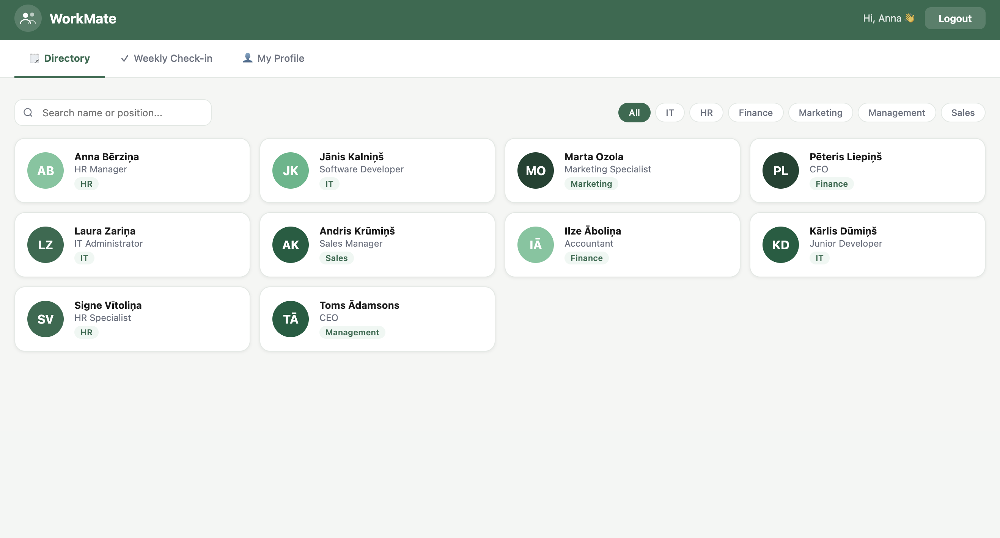
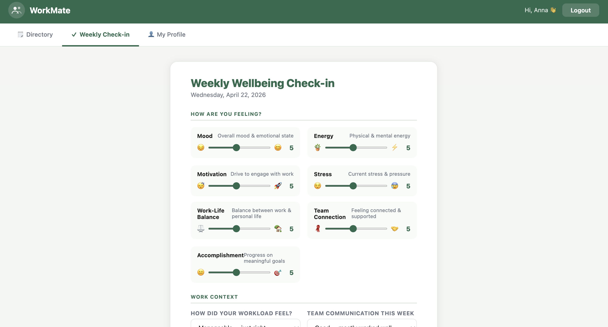
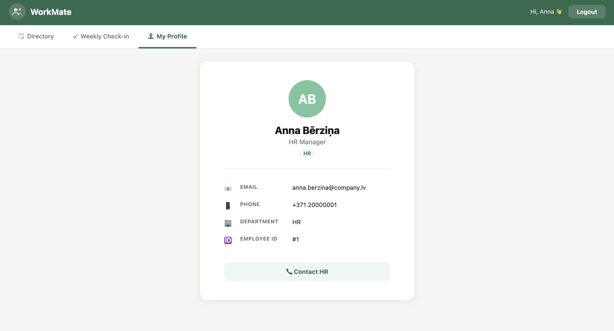
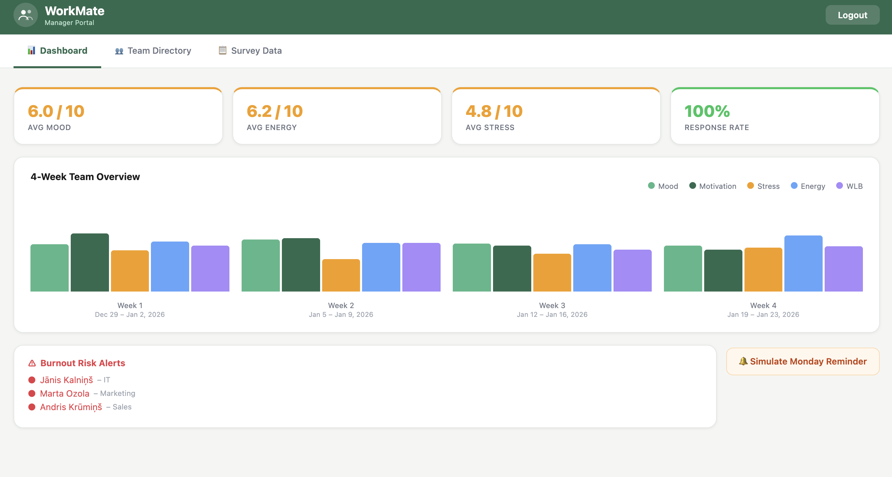
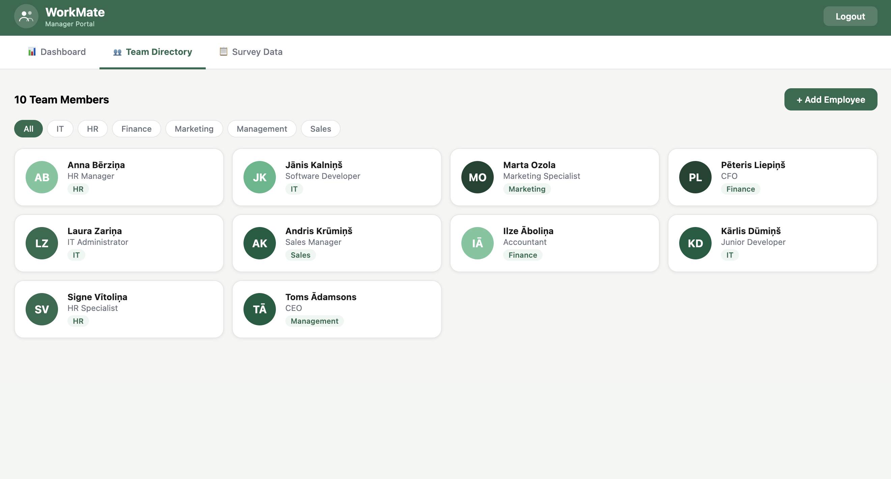
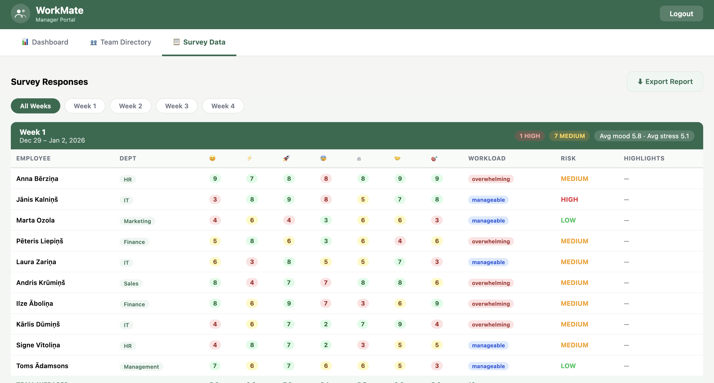

# WorkMate — Employee Wellbeing Platform

A Java desktop application that runs silently in the system tray and serves a modern web UI at `http://localhost:8765`. Employees and managers access it through any browser on the same network.

---

## Screenshots

### Employee Portal
| Directory | Weekly Check-in | My Profile |
|-----------|----------------|------------|
|  |  |  |

### Manager Portal
| Dashboard | Team Directory | Survey Data |
|-----------|---------------|-------------|
|  |  |  |

---

## Features

- **Employee portal** — Company directory, weekly wellbeing check-in, personal profile
- **Weekly check-in** — 7 psychological wellbeing sliders + open-text reflection questions (available Thu–Fri only)
- **Manager dashboard** — 4 key metrics, 5-dimension weekly bar chart, burnout risk alerts
- **Survey data view** — grouped by week with date ranges, colour-coded cells, team averages, CSV export
- **System tray** — app lives only in the menu/taskbar; tray click opens the browser
- **Network-ready** — binds to all interfaces so colleagues on the same LAN or VPN can connect

---

## Wellbeing Dimensions Tracked

| Dimension | Scale | Why it matters |
|-----------|-------|----------------|
| Mood | 1–10 | Core emotional state indicator |
| Energy | 1–10 | Physical/mental fatigue signal |
| Motivation | 1–10 | Engagement & discretionary effort |
| Stress | 1–10 (inverted) | Primary burnout predictor |
| Work-Life Balance | 1–10 | Sustainable performance |
| Team Connection | 1–10 | Social belonging & psychological safety |
| Accomplishment | 1–10 | Sense of purpose & progress |

Plus: workload feel, team communication quality, open reflection (what went well / challenges / support needed).

**Risk levels** are computed from a weighted composite score across all dimensions.

---

## Algorithms

| Algorithm | Location | Complexity |
|-----------|----------|------------|
| Bubble Sort | `EmployeeDirectory.sortByName()` | O(n²) |
| Linear Search | `EmployeeDirectory.findByName()` | O(n) |
| Binary Search | `EmployeeDirectory.binarySearch()` | O(log n) |
| Stack push/pop | `SurveyManager` activity log | O(1) |
| Queue enqueue/dequeue | `SurveyManager` reminder queue | O(1) |

---

## Quick Start (local / developer)

```bash
# 1. Compile
cd WorkMate
find src -name "*.java" > sources.txt
javac -d out @sources.txt

# 2. Run
java -cp out com.workmate.WorkMateApp

# 3. Open browser (opens automatically)
open http://localhost:8765
```

**Login credentials**
- Employee: select name → Continue as Employee
- Manager: Manager Login → password `admin`

---

## Deployment on Windows Server

### Option A — Run as a background process (quick demo)

```bat
java -cp out com.workmate.WorkMateApp
```

Access from other machines on the same network:
```
http://<server-ip>:8765
```

### Option B — Run as a Windows Service (production)

Use **NSSM** (Non-Sucking Service Manager) to run WorkMate as a proper Windows service that starts on boot.

1. Download NSSM from https://nssm.cc/download
2. Open Command Prompt as Administrator:

```bat
nssm install WorkMate "C:\Program Files\Java\jdk-25\bin\java.exe"
```

3. In the NSSM dialog set:
   - **Path**: `C:\Program Files\Java\jdk-25\bin\java.exe`
   - **Arguments**: `-cp C:\WorkMate\out com.workmate.WorkMateApp`
   - **Startup directory**: `C:\WorkMate`

4. Start the service:

```bat
nssm start WorkMate
```

To stop or remove:
```bat
nssm stop WorkMate
nssm remove WorkMate
```

### Option C — JAR + startup script

```bash
# Build JAR
jar cfm WorkMate.jar manifest.txt -C out .

# Run
java -jar WorkMate.jar
```

`manifest.txt`:
```
Main-Class: com.workmate.WorkMateApp
```

---

## Multi-User / VPN Setup

WorkMate binds to **all network interfaces** (0.0.0.0) by default. This means:

1. Run WorkMate on a central server (Windows or Linux)
2. Ensure port **8765** is open in the Windows Firewall:
   ```bat
   netsh advfirewall firewall add rule name="WorkMate" dir=in action=allow protocol=TCP localport=8765
   ```
3. Employees connect via browser:
   ```
   http://<server-ip>:8765
   ```
   or via VPN hostname:
   ```
   http://workmate.company.internal:8765
   ```

### Recommended network setup

```
[Employee laptops]  ──VPN──  [Company Server: WorkMate :8765]
[HR workstation]    ──LAN──  [Company Server: WorkMate :8765]
```

> **Security note:** WorkMate is a demo/course project. For production use, add HTTPS (reverse proxy with nginx/IIS + Let's Encrypt) and replace the hardcoded password with proper authentication.

### Change the port

Edit `WorkMateApp.java` line:
```java
static final int PORT = 8765;
```

---

## Project Structure

```
WorkMate/
├── src/com/workmate/
│   ├── WorkMateApp.java          — entry point, tray, data init, web server start
│   ├── model/
│   │   ├── Employee.java         — base class (id, name, position, dept, email, phone)
│   │   ├── Manager.java          — extends Employee, adds teamSize
│   │   ├── SurveyResponse.java   — 7-dimension check-in + risk scoring
│   │   ├── EmployeeDirectory.java — ArrayList + bubble sort + linear/binary search
│   │   └── SurveyManager.java    — responses, Stack activity log, Queue reminders
│   ├── service/
│   │   ├── WebServer.java        — embedded HTTP server, REST API, full HTML/JS/CSS
│   │   └── NotificationService.java — system tray notifications
│   └── util/
│       └── LogoDrawer.java       — Java2D tray icon
└── README.md
```

---

## Requirements

- Java 11 or higher (tested on Java 25 Temurin)
- No external dependencies — uses only the JDK standard library
- Any modern browser (Chrome, Firefox, Safari, Edge)
